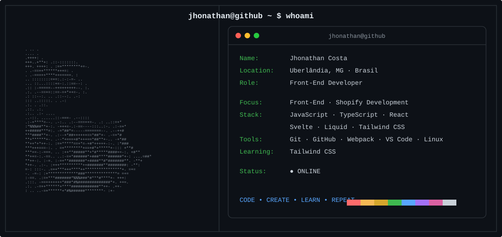
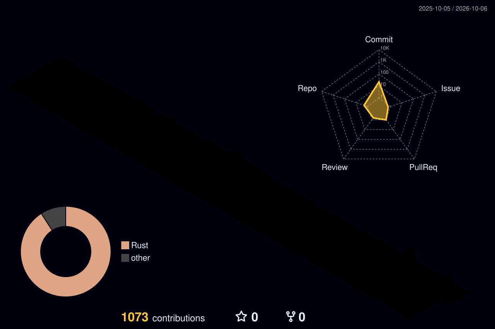

<div align="center">

# ⚡ JHONATHAN COSTA ⚡

### `< Front-End Developer />`


</div>

---
<div align="center">

## `jhonathan@github ~ $ whoami`



</div>

```text
┌──────────────────────────────────────────────────────────────┐
│                                                              │
│  USER        Jhonathan Costa                                 │
│  ROLE        Front-End Developer                             │
│  LOCATION    Uberlândia, MG - Brasil                         │
│                                                              │
│  FOCUS       Front-End Development                           │
│              Shopify Development                             │
│              Modern Web Technologies                         │
│                                                              │
│  STACK       JavaScript • TypeScript • React                 │
│              Svelte • Liquid • Tailwind CSS                  │
│                                                              │
│  TOOLS       Git • GitHub • Webpack • VS Code • Linux        │
│                                                              │
│  STATUS      ● ONLINE                                        │
│                                                              │
└──────────────────────────────────────────────────────────────┘
```

<div align="center">

Sou desenvolvedor **Front-End**, apaixonado por tecnologia e por transformar ideias em experiências digitais.

Natural de **Araxá/MG** e atualmente em **Uberlândia/MG**.

Cursando **Análise e Desenvolvimento de Sistemas na Anhanguera**.

</div>

---

<div align="center">

## `jhonathan@github:~$ ./tech-stack`

### ⚡ Front-End


<br><br>

### 🛠️ Ferramentas & Tecnologias


<br><br>


</div>

---

<div align="center">

## `jhonathan@github:~$ ./github-stats`


</div>

---

<div align="center">

## `jhonathan@github:~$ ./streak`


</div>

---

<div align="center">

## `jhonathan@github:~$ ./activity`


</div>

---

<div align="center">

## `jhonathan@github:~$ ./3d-contributions`



</div>

---

## `> system_status`

```yaml
user: JhonathanCosta-Dev

status: online

role:
  Front-End Developer

focus:
  - Front-End Development
  - Shopify Development
  - Modern Web Technologies

learning:
  - Tailwind CSS

working_with:
  - JavaScript
  - TypeScript
  - React
  - Shopify
  - Liquid
  - Svelte
  - Webpack

environment:
  OS: Linux
  Editor: VS Code

mission:
  "CODE • CREATE • LEARN • REPEAT"
```

---

<div align="center">

## `jhonathan@github:~$ contact --open`

### 💻 Vamos construir algo juntos?

Estou aberto a **oportunidades, projetos e novas conexões**.

<br>


<br><br>


<br>

`© Jhonathan Costa // Front-End Developer`

</div>
